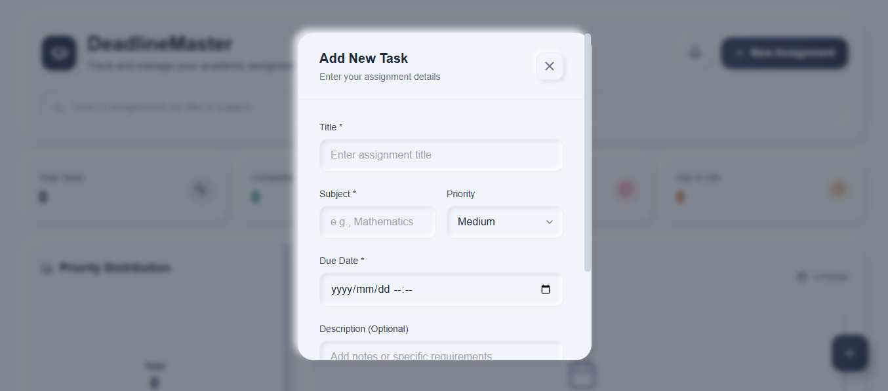
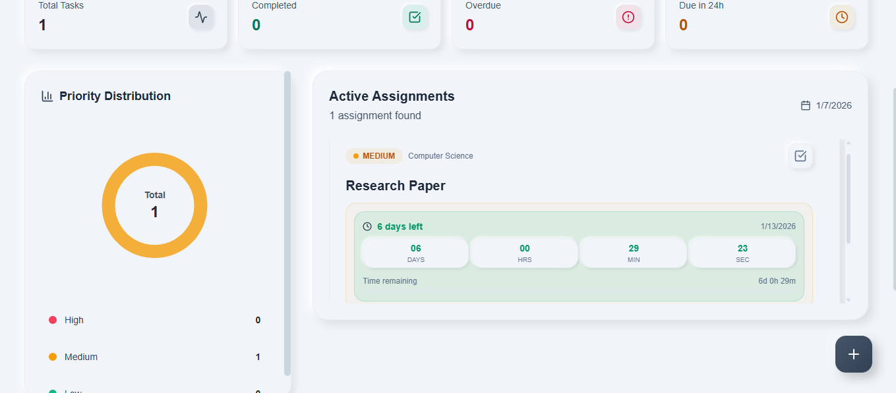

# 📚 Deadline Master

**Deadline Master** is a modern, React-based productivity application designed to help students and early-career professionals **track assignments, manage priorities, and meet deadlines** using real-time countdowns and a clean, responsive UI.


---

## 🚨 Problem

Students often miss assignment deadlines because:
- Tasks are scattered across platforms
- There’s no clear sense of urgency
- Deadlines aren’t visually tracked in real time

This project addresses those issues by providing a **single, intuitive dashboard** that visualizes deadlines and task urgency in real time.


---

## 💡 Solution

This application provides a **centralized dashboard** where students can:
- Add and manage assignments
- See **live countdown timers**
- Mark tasks as completed
- Prioritize work effectively

All data is stored locally, making the app fast, simple, and privacy-friendly.

---

## ✨ Features

- ⏳ **Live Countdown Timer** (days, hours, minutes, seconds)
- 🔴🟠🟢 **Priority Levels** (High, Medium, Low)
- ✅ **Mark Assignments as Complete**
- ✏️ **Edit Existing Assignments**
- 🗑️ **Delete Assignments**
- 💾 **Persistent Storage** using `localStorage`
- ⚠️ **Visual Deadline Alerts**
  - Urgent (less than 24 hours)
  - Warning (1–3 days)
  - Overdue state
- 🎨 **Glassmorphism UI** with smooth animations

---

## 🛠️ Tech Stack

- **React** (Hooks & Functional Components)
- **JavaScript (ES6+)**
- **Tailwind CSS**
- **Lucide React Icons**
- **LocalStorage API**

---

## 📂 Project Structure


```
src/
├── components/
│ ├── AddAssignmentModel.jsx    # Add assignment modal
│ ├── AssignmentModel.jsx       # Edit assignment modal
│ ├── AssignmentCard.jsx        # Assignment display card
│ └── CountdownTimer.jsx        # Real-time deadline logic
│
├── services/
│ └── storageService.js         # LocalStorage abstraction
│
├── App.jsx
├── main.jsx
└── index.css

```

---

## ⚙️ Installation & Setup

**1. Clone the repository**
```
git clone https://github.com/Khalipha-Samela/Deadline-Master.git

```

**2. Navigate to the project**

```
cd DeadlineMaster
```

**3. Install dependencies**
```
npm install
```

**4. Start the development server**
```
npm run dev
```

---

## 📸 Project Screenshots

### Dashboard Overview


### Add / Edit Assignment Modal


### Deadline Countdown States


---

## 🧠 Key Learning Outcomes

- Managing complex state with React hooks
- Building reusable UI components
- Working with dates & real-time countdown logic
- Persisting data using browser storage
- Creating UX-focused interfaces for real users

---

## 🔧 Key Components Explained

**AssignmentModal**

A reusable modal component used for both **adding and editing assignments**, featuring:
- Controlled form inputs
- Validation
- Date-time selection

**CountdownTimer**
A real-time timer component that:
- Calculates remaining time dynamically
- Adjusts UI based on urgency
- Displays progress indicators
- Handles overdue and completed states

**storageService**
A lightweight abstraction layer for:
- Saving assignments to localStorage
- Loading persisted data
- Handling parse errors safely

---

## 🚀 Future Improvements

- 🔔 Deadline notifications
- ☁️ Cloud sync (Firebase / Supabase)
- 📊 Analytics dashboard
- 📱 Mobile-first enhancements
- 👤 User authentication & profiles

---

## 📜 License
This project is open-source and available under the MIT License.

